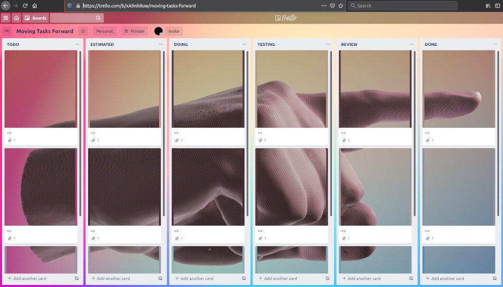

# MovingTasksForward

## Requirements

- 1. You need to be able to run a local server. If you do not have it, have a look at this [quick ways](https://github.com/processing/p5.js/wiki/Local-server) to run a local webserver.

- 2. You need a Trello Account containing the board with your tasks, and an [API key](https://trello.com/app-key). As "allowed origin" for that API Key, enter the address of your local server, for example `http://localhost:5000`.

- 3. Get the long ID of the board containing the tasks that you want to move forward. As explained in this [post](https://community.atlassian.com/t5/Trello-questions/How-to-get-Trello-Board-ID/qaq-p/1347525), an easy way to find the long ID of your board is to append `.json` to the URL of your board. For Example, if the URL  of your board is `https://trello.com/b/xxxxxxxx/things-to-do`, then at the URL `https://trello.com/b/xxxxxxxx/things-to-do.json` you can find the id. It is the first value in the JSON response.

## Installation

- Download and unzip this repository.
- Open the file index.html with a text editor, change the value of the variable `YOUR_BOARD_ID` with the ID of your board.
- Change the value of the variable `YOUR_TRELLO_API_KEY` with your API key.
- Launch a webserver in the folder where the index.html file is and open the Web Server URL. A pop-up should ask you if you want to authorize this application to edit your board. Click on the "Allow" button.

